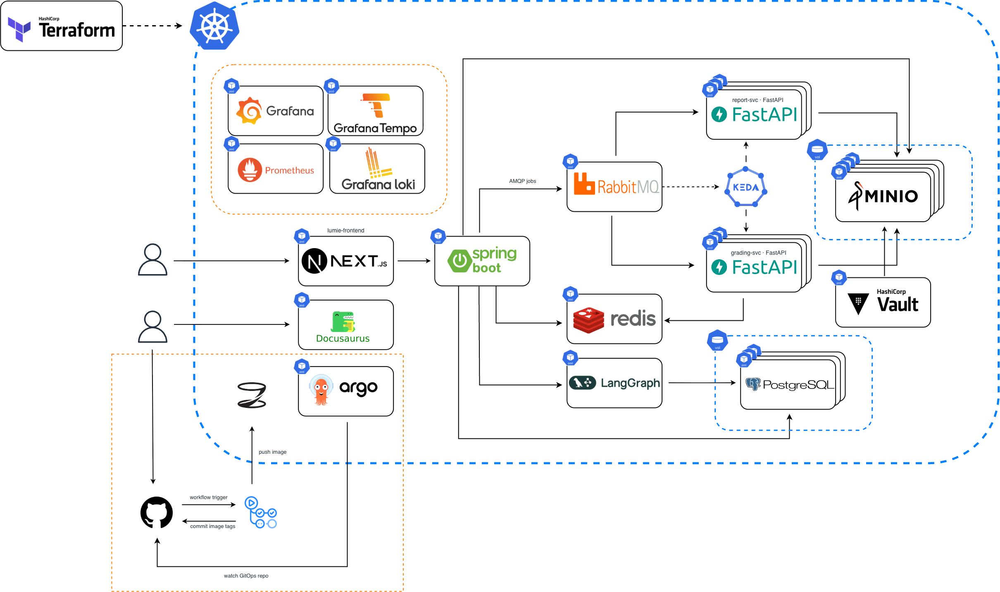

<picture>
  <source media="(prefers-color-scheme: dark)" srcset="./assets/poolc.dark.svg" />
  <source media="(prefers-color-scheme: light)" srcset="./assets/poolc.vertical.svg" />
  
</picture>

연세대학교 공과대학 동아리 PoolC 공식 GitHub

| Frontend | Backend | Infrastructure |
| :---: | :---: | :---: |
|  |  |  |

## Architecture

  

## Current Maintainer

<table align="center">
  <tr>
    <th align="center"><a href="https://github.com/Mayne0213">Mayne0213</a></th>
  </tr>
  <tr>
    <td align="center"></td>
  </tr>
  <tr>
    <td align="center"><b>FE · BE · Infra · Handoff</b></td>
  </tr>
</table>

## Contributors & Alumni

<table align="center">
  <tr>
    <th align="center"><a href="https://github.com/jinhodotchoi">jinhodotchoi</a></th>
    <th align="center"><a href="https://github.com/mingd1023">mingd1023</a></th>
    <th align="center"><a href="https://github.com/Hys-Lee">Hys-Lee</a></th>
    <th align="center"><a href="https://github.com/jimmy0006">jimmy0006</a></th>
    <th align="center"><a href="https://github.com/hcpak">hcpak</a></th>
  </tr>
  <tr>
    <td align="center"></td>
    <td align="center"></td>
    <td align="center"></td>
    <td align="center"></td>
    <td align="center"></td>
  </tr>
  <tr>
    <td align="center"><b>FE · BE</b></td>
    <td align="center"><b>FE · BE</b></td>
    <td align="center"><b>FE</b></td>
    <td align="center"><b>FE · BE · Infra</b></td>
    <td align="center"><b>BE</b></td>
  </tr>
  <tr>
    <th align="center"><a href="https://github.com/becooq81">becooq81</a></th>
    <th align="center"><a href="https://github.com/yoonseokch">yoonseokch</a></th>
    <th align="center"><a href="https://github.com/Jjungs7">Jjungs7</a></th>
    <th align="center"><a href="https://github.com/J3m3">J3m3</a></th>
  </tr>
  <tr>
    <td align="center"></td>
    <td align="center"></td>
    <td align="center"></td>
    <td align="center"></td>
  </tr>
  <tr>
    <td align="center"><b>BE</b></td>
    <td align="center"><b>BE</b></td>
    <td align="center"><b>BE</b></td>
    <td align="center"><b>Infra</b></td>
  </tr>
</table>

## Rules

- Current Maintainer는 홈페이지, 백엔드, 인프라 및 이 프로필 저장소를 관리합니다.
- 유지보수를 그만두거나 담당자가 변경되면 기존 담당자는 `Contributors & Alumni`로 이동합니다.
- 인수인계가 완료되면 새로운 담당자를 `Current Maintainers`에 추가합니다.
- 과거 기여자의 기록은 보존하며, 임의로 삭제하지 않습니다.
- 모든 저장소의 `main` 브랜치는 CI/CD로 자동 반영되므로, 변경사항은 `dev` 브랜치에서 작업하고 승인된 PR을 통해서만 `main`에 반영합니다.
- 프로필 README와 관련 파일의 변경은 현재 담당자의 검토 후 반영합니다.
- 이 README가 오래되지 않도록 담당자, 기여자, 운영 규칙 및 관련 링크를 변경사항에 맞춰 항상 관리합니다.
